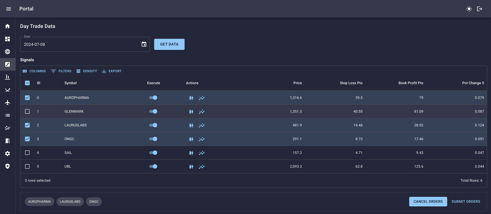
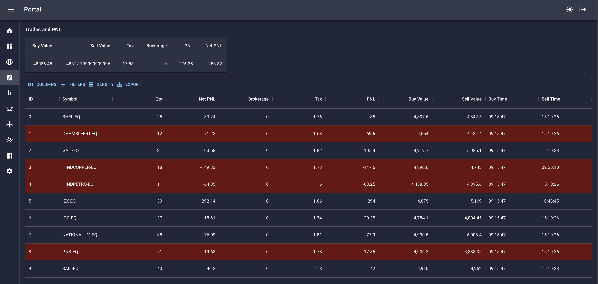
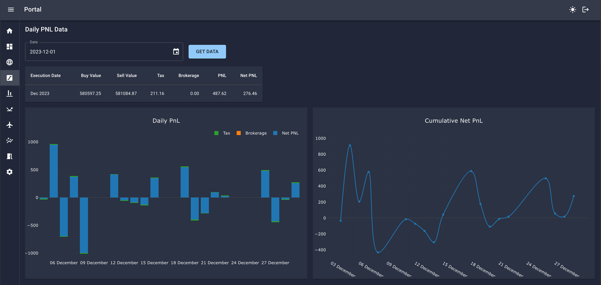
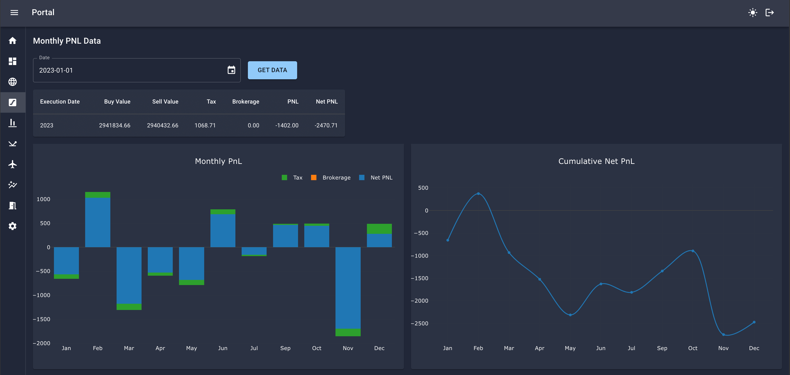
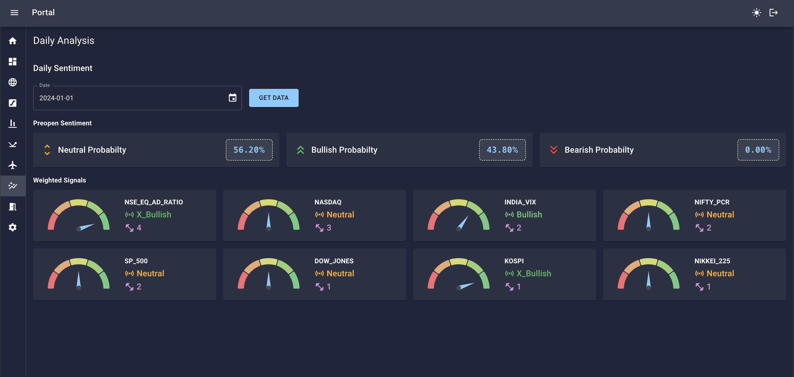
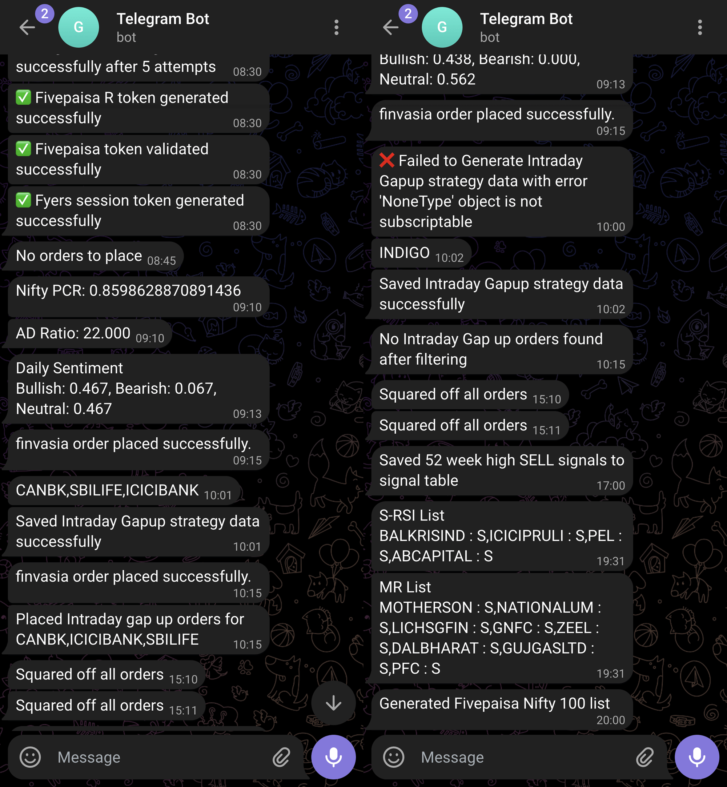

The following is a case study of my automated trading system. This post will walk through the process of building the system, the components and technologies used, how it works, and the challenges faced.

## Goal

* Develop a system that can automatically execute trades with minimal human intervention.
* Store upcoming trade signals and daily trade data.
* Keep costs as low as possible.

## Solution

* Build an event-driven system.
* Scan market data daily and weekly to generate trading signals using predefined rules built on top of indicators and price data.
* Validate signals manually if required, then save them to the database.
* Execute trade orders manually or automatically, depending on the strategy, on the same day or the next trading day.
* Save P\&L data to the database after market hours.
* Track performance, identify trends and tweak trading strategies based on results.

## Challenges

As a front-end developer, I had not yet learned how to build back-end systems. I had built a basic ExpressJS app with MongoDB a few years ago, but that was the extent of my experience. My deployment skills were limited to static front-end websites using Netlify and GitHub Pages. Working with AWS was like navigating a minefield. I spent 2 months taking Udemy courses, watching YouTube tutorials, and reading blogs to get a handle on AWS services.

Being proficient in the technical aspects of the system was not enough. I also had to have a thorough understanding of the markets. Before implementing the system, I spent many months learning technical analysis of the stock market. I did not intend to build the system while studying the markets. The idea of building the system came to me later.

## How Does It Work ?

The system is primarily constructed with Python. Python was selected because it is the most popular language for developing finance and data-related applications. Python is also the primary language for many data science libraries, such as [Pandas](https://pandas.pydata.org/), [Numpy](https://numpy.org/), and [TA-Lib](https://ta-lib.org/);

Pandas is used to handle large tabular datasets. Numpy is a numerical computation library that can solve large-scale mathematical problems at a faster speed. TA-Lib provides all the functions required to calculate Relative Strength Index (RSI), Moving Averages (MA), and other indicators.

All of the above libraries have a C and C++ backend, which is the main source of their speed. This speed is necessary to run calculations for hundreds of stocks, each of which has 200 or more days of historical data.

## Analysis Dashboard

The following is a dashboard that presents data based on the trades executed by the system. This dashboard has been built using [Streamlit](https://streamlit.io/) and is hosted on Streamlit Cloud. The rationale for employing this technology is that Streamlit allows the creation of browser applications using Python. This feature enables access to various analytical libraries such as Numpy, Pandas, and Scipy that are not accessible in a Javascript environment.

You can access the hosted dashboard at [Automated Trading System Dashboard](https://gmmm-dashboard.streamlit.app/), and the source code for the project is available on [Github Repo](https://github.com/gautamnaik1994/Automated-Trading-System-Dashboard).

<iframe
  src="https://gmmm-dashboard.streamlit.app/?embed=true"
  height="600"
  className="blog-wide-section"
  title="Automated Trading System Dashboard"
></iframe>

## Backend System

### Lambda functions

[AWS Lambda](https://aws.amazon.com/lambda/) functions are comparable to microservices, which can be manually run by invoking them via API Gateway or AWS Scheduler. The objective is to divide your application into tiny bits of logic. Each function should perform a single task. For example, a Lambda function can get a day's trade signals from a database and place an order on the market by calling the broker API. If you have chosen to enable this behaviour, a Lambda function will restart if it fails or crashes.&#x20;

**Following is the code snippet on how to set up a lambda function using Python runtime**

```typescript
const saveLiquidStocksTokenFn = new lambda.Function(
  this,
  "SaveLiquidStocksTokenFn",
  {
    //can use Java, Javascript etc
    runtime: lambda.Runtime.PYTHON_3_9,
    handler: "save_liquid_stocks.lambda_handler",
    code: lambda.Code.fromAsset("src/stock_token/fno_stocks"),
    timeout: Duration.minutes(5),

      // faster & cheaper, but complex setup
    architecture: lambda.Architecture.ARM_64,

    //common code shared between functions
    layers: [pandasTaLibLayer, utilsLayer],

    //pass env variable
    environment: {
      S3_BUCKET_NAME: csvBucket.bucketName,
      SYSTEM_CONFIG_TABLE: systemConfigTableV1.tableName,
    },

    //more memory, more speed, more cost
    memorySize: 512,
  }
);
```

**Following is the skeleton code of the lambda function**

````python
import pandas as pd
import logging
import boto3
from botocore.exceptions import ClientError
import os
import requests
import send_telegram

# Access AWS resources using boto3 library
s3_client = boto3.client('s3')
dynamodb = boto3.resource('dynamodb')
# Access environment variables passed while creating lambda fn
system_config_table_name = os.environ['SYSTEM_CONFIG_TABLE']
table = dynamodb.Table(os.environ['S3_BUCKET_NAME'])


def lambda_handler(event, context):
    try:
        # Logic
        send_telegram.t_success("Success")

    except Exception as e:
        send_telegram.t_error(f" Exception: ``` {e}```")
        logging.error(f" Exception: {e}")
````

### S3 Bucket

S3 is a cloud-based storage service that I use to store all of my stock symbols data in CSV format. I chose S3 over DynamoDB because CSV files can be large, and I need to be able to download them in bulk. DynamoDB is not a good fit for this task because it is not designed for storing and retrieving large amounts of data.

**Following is the code to set up S3 bucket**

```typescript
const csvBucket = new s3.Bucket(this, "Bucket", {
  removalPolicy: RemovalPolicy.RETAIN,
});

```

### DynamoDB

This is where I store all the data about trading signals, past trades, and their PNL data.

```typescript
const systemConfigTableV1 = new db.Table(this, "SystemConfigTable", {
  partitionKey: {
    name: "pk",
    type: db.AttributeType.STRING,
  },
  //Both partition key and sort key make a primary key
  sortKey: {
    name: "sk",
    type: db.AttributeType.STRING,
  },
  // Will not be billed for individual requests
  billingMode: db.BillingMode.PROVISIONED,
  removalPolicy: RemovalPolicy.RETAIN,
  readCapacity: 2,
  writeCapacity: 1,
});
```

### Scheduler

This is where the event to run the function at a particular time is created. It is similar to a cron job. This was the second most important AWS service to me as I have more than 20 cron jobs which will keep on increasing as the project grows.

**Following is the code to set cron schedule**

```typescript
//create schedule
const tokenGeneratorFnCron = new events.Rule(
  this,
  "TokenGeneratorFnCronRule",
  {
    schedule: events.Schedule.cron({
      minute: "40",
      hour: "13",
      weekDay: "FRI",
      month: "*",
      year: "*",
    }),
  }
);

//call the function at above schedule
tokenGeneratorFnCron.addTarget(
  new targets.LambdaFunction(saveLiquidStocksTokenFn)
);
```

### API Gateway

This service is used to build APIs. These APIs can be linked to Lambda functions. This means I can call a Lambda function by calling an API endpoint.

**Folowing is the code to set up the API Gateway**

```typescript
const httpApiV1 = new HttpApi(this, "Api", {
  corsPreflight: {
    allowHeaders: ["Authorization", "Content-Type"],
    allowMethods: [
      CorsHttpMethod.GET,
      CorsHttpMethod.POST,
      CorsHttpMethod.PUT,
      CorsHttpMethod.DELETE,
    ],
    allowOrigins: ["*"],
    maxAge: Duration.days(10),
  },
});

httpApiV1.addRoutes({
  path: "/demo/{date}",
  methods: [HttpMethod.GET],
  integration: new HttpLambdaIntegration(
    "DemoApi",
    DemoLambdaFunction, //Lambda function to call
  ),
  authorizer,
});
```

### Cognito

Amazon Cognito provides secure access to your app's backend resources in AWS or any service behind Amazon API Gateway. I used it so that I can access my AWS services from my frontend website.

## Frontend

The front end is built with ReactJS, [Material UI](https://mui.com/), and [SWR](https://swr.vercel.app/). It is an admin portal for the system, where I can control the configurations, such as how much funds to allocate to each strategy.

It also shows the upcoming trade signals, the past trade signals along with their PNL data. Additionally, it shows plots of daily and monthly performance and cumulative PNL. All of this data is fetched from DynamoDB through APIs built with API Gateway.

There is also an option to square off all trades during emergencies.

**Following are some screenshots of the admin portal**


<p class="text-center">Daily Signals</p>


<p class="text-center">Daily Trades</p>


<p class="text-center">Daily PNL</p>


<p class="text-center">Monthly PNL</p>


<p class="text-center">Daily Analysis</p>

## DevOps

To reduce costs, I used [AWS Serverless](https://aws.amazon.com/serverless/) architecture for this project. It has a generous free tier that is appropriate for small projects. I employed AWS CDK (Cloud Development Kit) to accomplish this. It is an infrastructure-as-a-code tool like Terraform, but it is exclusively designed for AWS services. Keep in mind that AWS CDK is not limited to serverless applications. The output of this project is a Cloudformation file, which instructs AWS on how to configure all of the services.

AWS CDK can be used with Typescript, Python, and other languages. I used Typescript because of the type checking that CDK provided when combined with VS Code.

## Error Reporting

Software and apps will inevitably experience problems, errors, and crashes. The same was true for me. Because my entire app was built on the broker's API, there was a possibility of failure. I might have integrated a service like Sentry.io or Rollbar. However, I opted for a simpler solution. Telegram Bot.

All you have to do is make an API request with the content and bot token, and you'll get a notification in your Telegram app. I set up all of my success messages and errors on Telegram, along with the error code or message.


<p class="text-center">Telegram</p>

## Closing thoughts

The system is currently under development and various features are still being worked on to enhance its functionalities. As the development progresses, I will be constantly adding more strategies and refining the existing ones. At the same time, I will also be improving my engineering skills to ensure better output.
