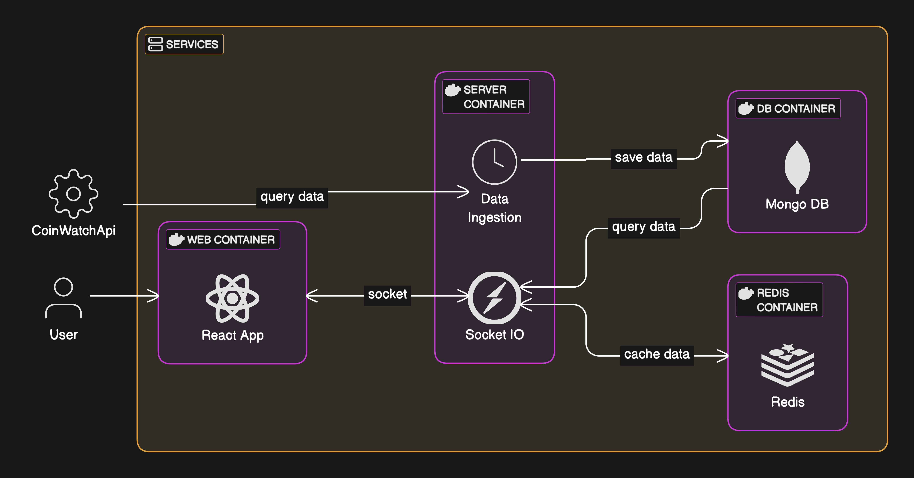

## Problem Statement

Build a real-time cryptocurrency price tracking application that streams price data from a third-party API.
Store the data in a database and serve it to multiple clients.
The application should include a frontend that displays the price data dynamically.Historical data should be stored in a database.

## Solution

The solution is to build a application using React, Express, Socket.io, Redis and MongoDB.
Docker will be used to containerize the application and Docker Compose will be used to manage the containers.

> The goal of this project is to showcase how to use docker and docker-compose to build a multi-container application.

## Architecture

Following is the architecture diagram of the application



### Frontend

- NextJS was used to build the frontend of the application.
- Socket.IO was used to stream the price data from the backend to the frontend.

#### Dockerfile

NextJS repo contains a `Dockerfile` that can be used to build the frontend.
Following is the link to the `Dockerfile` for the frontend.

[Dockerfile](https://github.com/vercel/next.js/blob/canary/examples/with-docker/Dockerfile)

If above file is not available, then use following link.

[Dockerfile](https://github.com/gautamnaik1994/fullstack_docker_multi_container/blob/main/app/Dockerfile)

### Backend

- The backend was responsible for fetching the price data from the third-party API, storing it in the database, and serving it to the frontend.
- Express JS was used to build the backend of the application.
- Since this app required continuos streaming of price data, Socket.IO was used.

#### Dockerfile

Following is the `Dockerfile` for the backend.

```Dockerfile
FROM node:18-alpine

# Set the working directory
WORKDIR /usr/src/app

# Copy package.json and package-lock.json to install dependencies
COPY ./package.json ./
COPY ./package-lock.json ./

# Install dependencies
RUN npm install

# Copy the rest of the application code
COPY ./tsconfig.json ./
COPY ./src ./src
COPY ./index.ts ./

# Build the TypeScript code
RUN npm run build

# Use the transpiled JavaScript files
CMD ["node", "dist/index.js"]
```

### Caching

- Redis was used as a cache to store the price data in memory. Every new request for price data would first check the cache, and if the data was not found, it would fetch the data from the database and store it in the cache.

### Database

- MongoDB was used as the database for the application.
- MongoDB also supports time-series data, which makes it a good choice for storing historical price data.
- You can read more about Time Series collections in MongoDB [here](https://www.mongodb.com/products/capabilities/time-series).
- Following is the link to the documentation for using MongoDB with Time Series
  collections. [Time Series Collections](https://www.mongodb.com/docs/manual/core/timeseries-collections/)

## Containerization

One can develop and deploy most of the web apps without need for containerization.
However, containerization is a good practice to ensure that the application runs consistently across different environments.
Docker Compose is a tool that allows you to define and run multi-container Docker applications. It uses a YAML file to configure the application's services, networks, and volumes.

You can learn more about Docker Compose [here](https://docs.docker.com/compose/).

Following is the `docker-compose.yml` file that defines the services for the application.

```yaml
services:
  mongo_db:
    command: mongod --quiet
    image: mongo:latest
    container_name: database_container
    restart: always
    volumes: # persist the data in the mongo_db volume after the container is stopped
      - mongo_db:/data/db
    ports:
      - 27017:27017
  redis:
    image: redis:latest
    container_name: redis_container
    restart: always
    ports:
      - 6379:6379
  server:
    build: ./server/.
    ports:
      - 8080:8080
    environment:
      MONGO_DB_URL: ${MONGO_DB_URL} # mongodb://mongo_db:27017/fullstack_docker
      PORT: ${PORT}
      DATABASE_NAME: ${DATABASE_NAME}
      COIN_API_KEY: ${COIN_API_KEY}
      DATA_INGESTION_INTERVAL_SECONDS: ${DATA_INGESTION_INTERVAL_SECONDS}
      REDIS_URL: ${REDIS_URL} # redis://redis:6379
    # wait for the mongo_db and redis containers to be ready before starting the server container
    depends_on:
      - mongo_db
      - redis
  web:
    build: ./app/.
    ports:
      - 3000:3000
    environment:
      NEXT_PUBLIC_API_URL: ${NEXT_PUBLIC_API_URL}
    depends_on:
      - server

volumes:
  mongo_db: {}
```

In above file, we have defined four services: `mongo_db`, `redis`, `web` and
`server`. The `mongo_db` service uses the `mongo:latest` image to run a MongoDB.
The `redis` service uses the `redis:latest` image to run a Redis server.

## Video

Following is the video that demonstrates the application.

<iframe width="100%" height="900" className="blog-wide-section google-slides"
src="https://www.youtube.com/embed/qBpcCyikD0A">
</iframe>

## Links

**Github Repository** : [https://github.com/gautamnaik1994/fullstack_docker_multi_container](https://github.com/gautamnaik1994/fullstack_docker_multi_container)

## Conclusion

In this post, we discussed how to build a fullstack multi-container application
using React, Express, Redis, MongoDB, and Docker. We also discussed how to use
Docker Compose to manage the containers.
