## Introduction

<Alert variant="warning">
  This blog post is extensive. To navigate to a specific topic, utilize the provided "Table of Contents."
</Alert>

Imagine you run multiple retail stores. One day, you suddenly run out of your best-selling product because you didn't anticipate the high demand. Frustrating, right? That's where sales forecasting comes in handy. It helps you plan your inventory and manage resources efficiently, so you're always prepared for your customers' needs.  

Effective sales forecasting is fundamental for multiple aspects of retail management and operation, including:

**Inventory Management**  
Accurate sales forecasts help ensure that stores maintain optimal inventory levels—enough to meet customer demand without overstocking, which can lead to increased costs or waste, especially in the case of perishable goods.

**Financial Planning**  
Forecasting sales allow businesses to estimate future revenue and manage budgets more effectively. This is crucial for allocating resources to areas such as marketing, staffing, and capital investments.

**Marketing and Promotions**  
Understanding when sales peaks and troughs are likely to occur enables retailers to plan effective marketing campaigns and promotional offers to boost revenue or manage customer flow.

**Supply Chain Optimization**  
Sales forecasts inform production schedules, logistics, and distribution plans, ensuring that products are available where and when they are needed, thereby reducing transportation and storage costs.

**Strategic Decision Making**  
Long-term sales forecasting supports broader business strategies, including store expansions, market entry, and other capital expenditures.

This case study focuses on developing a predictive model that uses historical sales data from different stores to forecast sales for upcoming periods.

**3 examples of real-world market demand forecasting stories**

- A global alcohol brand used market demand forecasting models to avoid overproduction, saving $9 million per year.
- An electronics company used consumer sentiment and economic factors in its marketing strategy for a new mobile device, allowing them to identify profitable markets and exit unprofitable ones.
- A convenience store chain used predictive models for its market areas, reducing inventory costs and improving the bottom line by avoiding inventory overages.

## Process Flow

1. **Data Collection**: The first step is to collect the data from the source. In this case, we have a dataset containing historical sales data for multiple stores.
2. **Exploratory Data Analysis (EDA)**: Next, we perform EDA to understand the data, identify patterns, and generate insights that can inform further analysis and modelling.
3. **Hypothesis Testing**: We test several hypotheses related to the sales data to determine whether certain factors have a significant impact on sales.
4. **Time Series Analysis**: We analyze the sales data to identify trends, seasonality, and other patterns that can help us forecast future sales.
5. **Feature Engineering**: We create new features from the existing data to improve the performance of our models.
6. **Machine Learning Models**: We build machine learning models to predict future sales based on historical data. We experiment with different algorithms and hyperparameters to find the best model.
7. **Deployment**: We deploy the best model on the cloud and serve it using APIs or web applications like Streamlit.
8. **Monitoring and Maintenance**: We monitor the model's performance and update it as needed to ensure accurate and reliable sales forecasting.
9. **Feedback Loop**: We collect feedback from users and stakeholders to improve the model and make it more effective over time.
10. **Documentation**: We document the entire process, including data sources, methodology, results, and insights, to ensure transparency and reproducibility.
11. **Presentation**: We present the analysis's findings and insights to stakeholders and decision-makers to inform strategic planning and decision-making.
12. **Actionable Insights**: Based on the analysis, we provide actionable insights and recommendations to help businesses optimize their operations and maximize sales.
13. **Future Scope**: We identify areas for further research and improvement to enhance the accuracy and effectiveness of the sales forecasting model.

## Data

### Data Description

1. **ID**: Unique identifier for each record in the dataset.
2. **Store_id**: Unique identifier for each store.(1-365)
3. **Store_Type**: Categorization of the store based on its type. (S1, S2, S3, S4)
4. **Location_Type**: Classification of the store's location (e.g., urban, suburban).(L1, L2, L3, L4, L5)
5. **Region_Code**: Code representing the geographical region where the store is located.(R1, R2, R3, R4)
6. **Date**: The specific date on which the data was recorded.
7. **Holiday**: Indicator of whether the date was a holiday (1: Yes, 0: No).
8. **Discount**: Indicates whether a discount was offered on the given date (Yes/No).
9. **Orders**: The number of orders received by the store on the specified day.
10. **Sales**: Total sales amount for the store on the given day.

### Data Overview

- The dataset contains 188340 records
- The dataset contains data of 365 stores
- It seems like the stores are distributed in 4 regions. Each region has multiple Location types and Store types.

### Sample Data

<div className="side-scrolling-table-container">
<table>
   <thead>
      <tr >
         <th></th>
         <th>ID</th>
         <th>Store_id</th>
         <th>Store_Type</th>
         <th>Location_Type</th>
         <th>Region_Code</th>
         <th width="50%">Date</th>
         <th>Holiday</th>
         <th>Discount</th>
         <th>Orders</th>
         <th>Sales</th>
      </tr>
   </thead>
   <tbody>
      <tr>
         <th>147815</th>
         <td>T1147816</td>
         <td>136</td>
         <td>S2</td>
         <td>L5</td>
         <td>R4</td>
         <td style={{whiteSpace:'nowrap'}}>2019-02-09</td>
         <td>0</td>
         <td>No</td>
         <td>33</td>
         <td>21231.00</td>
      </tr>
      <tr>
         <th>173429</th>
         <td>T1173430</td>
         <td>6</td>
         <td>S4</td>
         <td>L1</td>
         <td>R1</td>
         <td>2019-04-21</td>
         <td>1</td>
         <td>Yes</td>
         <td>124</td>
         <td>69333.12</td>
      </tr>
      <tr>
         <th>84404</th>
         <td>T1084405</td>
         <td>151</td>
         <td>S1</td>
         <td>L3</td>
         <td>R2</td>
         <td>2018-08-20</td>
         <td>0</td>
         <td>Yes</td>
         <td>44</td>
         <td>27156.00</td>
      </tr>
      <tr>
         <th>58312</th>
         <td>T1058313</td>
         <td>34</td>
         <td>S1</td>
         <td>L3</td>
         <td>R1</td>
         <td>2018-06-09</td>
         <td>0</td>
         <td>No</td>
         <td>63</td>
         <td>35919.00</td>
      </tr>
      <tr>
         <th>173540</th>
         <td>T1173541</td>
         <td>310</td>
         <td>S2</td>
         <td>L5</td>
         <td>R1</td>
         <td>2019-04-21</td>
         <td>1</td>
         <td>No</td>
         <td>63</td>
         <td>36906.00</td>
      </tr>
   </tbody>
</table>
</div>

From the above data fields, we can see that the data contains both categorical and numerical features. The target variable is 'Sales', which we aim to forecast based on the other features. The data spans multiple stores, regions, and dates, providing a rich source of information for analysis and modelling.

### Data Sanity Check

Before we start with the analysis, it is important to perform a data sanity check to ensure that the data is clean and consistent. This involves checking for missing values, duplicates, outliers, and other anomalies that could affect the quality of the analysis and modelling.  
In this case, the data was clean and well-structured, with no missing values or duplicates.

## Exploratory Data Analysis (EDA)

EDA is an essential step in the data analysis process. It helps us understand the data, identify patterns, relationships, and anomalies, and generate insights that can inform further analysis and modelling. In this section, I will explore the sales data to gain a better understanding of the underlying patterns and trends.

### Uni-variate Analysis

#### Order Count Distribution

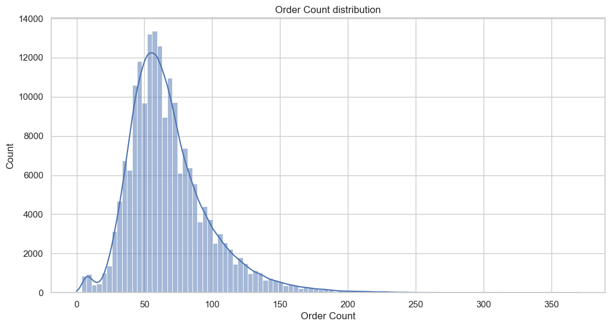

**Observations**

- We can see that most of the order count for each store is around 50 - 80  

---

#### Sales Distribution

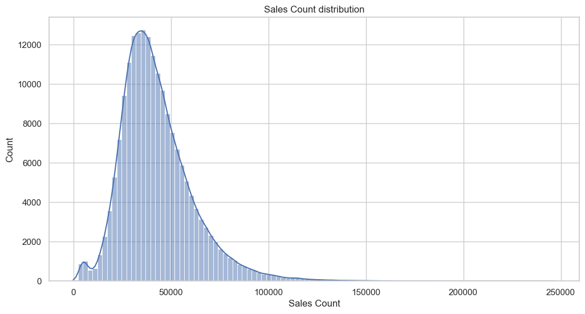

**Observations**

- We can see that most of the sales are around 50000

---

#### Top stores by Sales

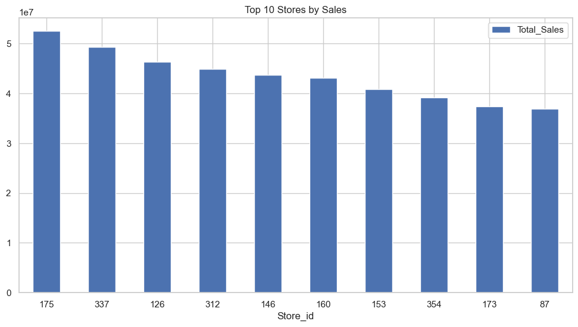

**Observations**

- From the above plot we can see that Store 175 has the highest number of sales

---

#### Stores in Each Region

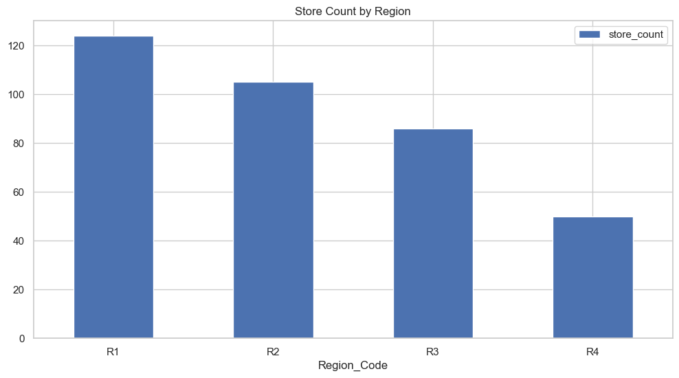

**Observations**

- There are 124 stores in R1 region, 105 in R2, 86 in R3 and 50 stores in R4 region

### Bi-variate Analysis

#### Regions by Sales and Orders

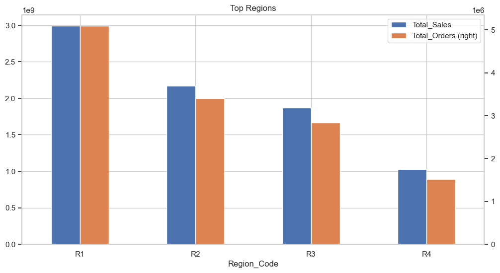

**Observations**

- We can see that Region R1 has the highest number of sales and orders
- Region R4 has the lowest number of sales and orders

---

#### Store by Sales and Orders

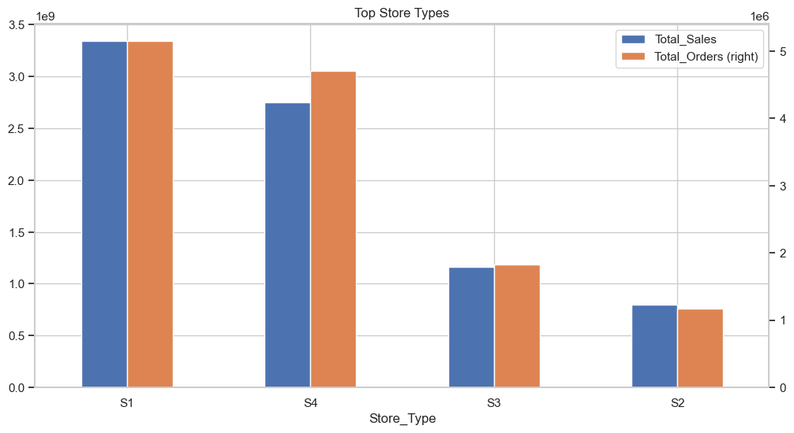

**Observations**

- We can see that Store type S1 has the highest number of sales and orders
- Store type S2 has the lowest number of sales and orders

---

#### Location by Sales and Orders

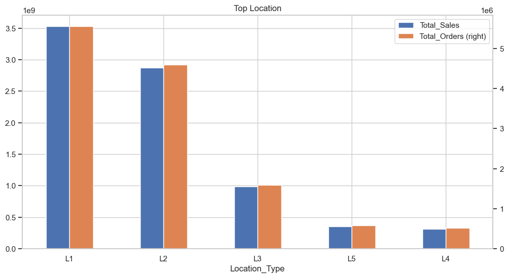

**Observations**

- We can see that Location type L1 has the highest number of sales and orders.
- Location type L4 has the lowest number of sales and orders.

---

### Multi-variate Analysis

#### Sales vs Orders by Store Type

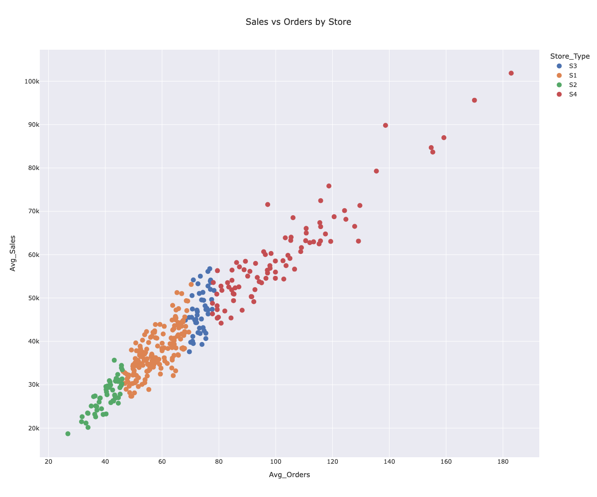

**Observations**

- From the above plot we can see a clear distribution of sales and orders by store for each Store type

---

#### Sales vs Orders by Location Type

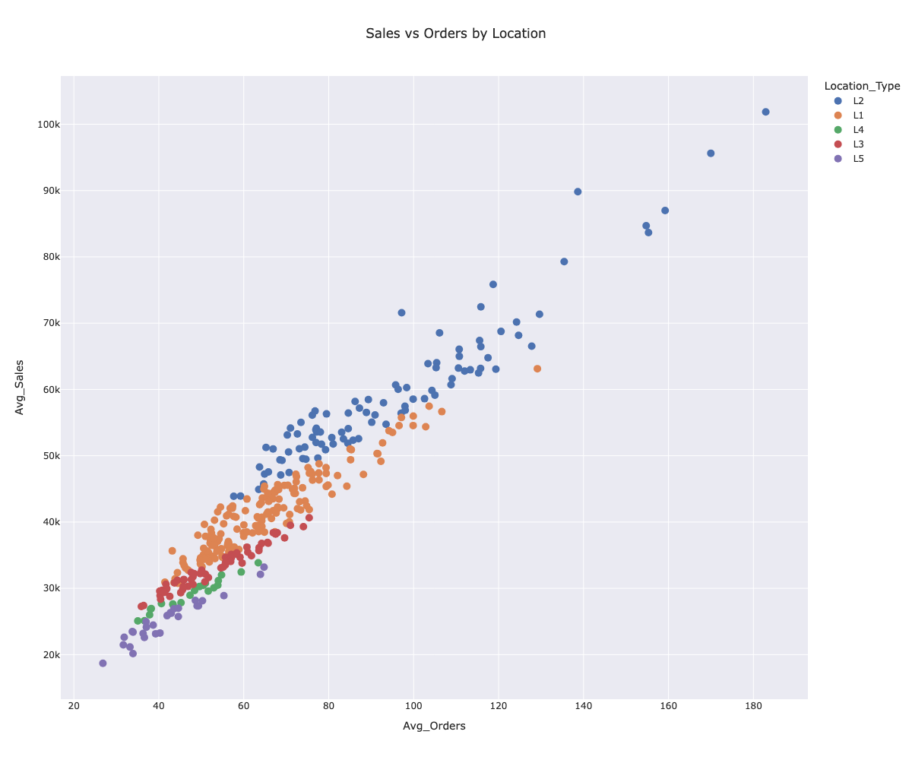

**Observations**

- From the above plot we can see a clear distribution of sales and orders by store for each Location type

---

#### Sales vs Orders by Region

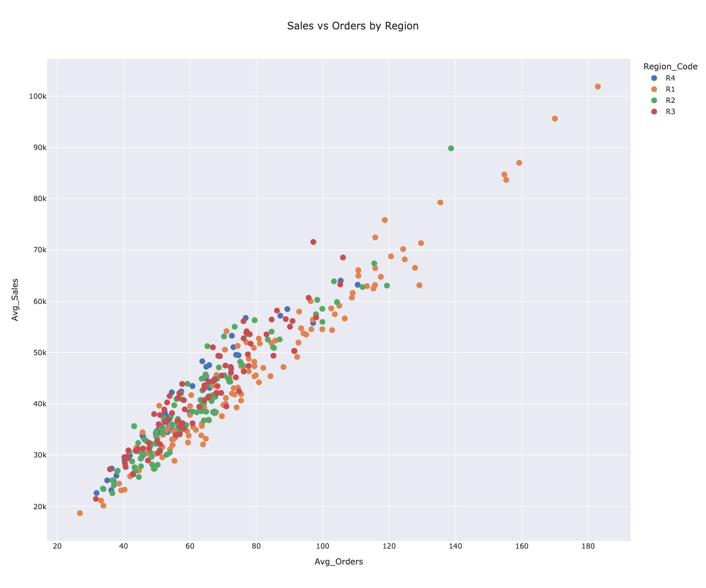

**Observations**

- From the above plot, we can see there is no clear distribution of sales and orders by store for each Region

Following is the link to the notebook for EDA:

[](https://nbviewer.org/github/gautamnaik1994/SalesForecasting_ML_CaseStudy/blob/main/notebooks/eda/01.EDA.ipynb?flush_cache=true)

## Tableau Dashboard

Data scientists and analysts often work in Jupyter notebooks, where they create and test new features. This process generates code that non-technical stakeholders may find difficult to interpret.

To share this analysis with a wider audience, I have created an interactive Tableau dashboard that visualizes the sales data and provides user-friendly features for data exploration. This dashboard makes the insights gleaned from the EDA process more accessible and understandable to those without a technical background.

### Planning Tableau Dashboard

Before starting the analysis, I created an outline of the Tableau dashboard to identify key insights.  

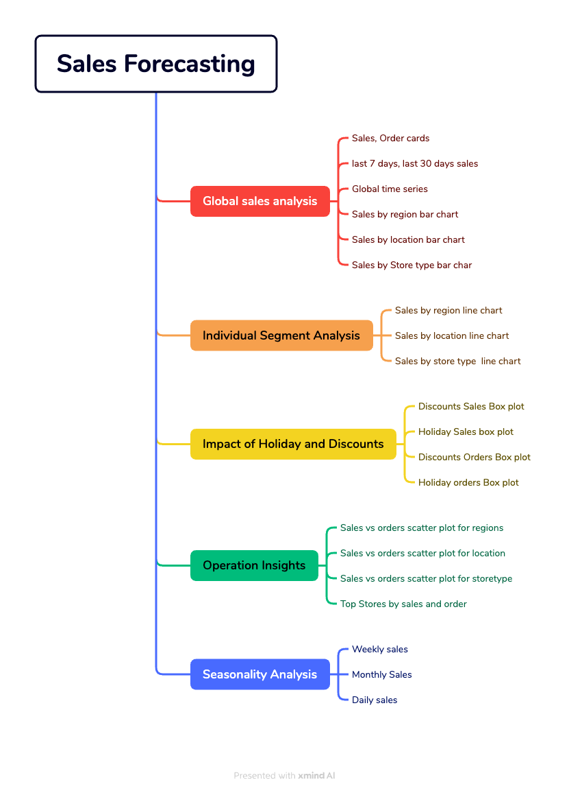

### Final Tableau Dashboard

This dashboard provides an overview of the sales data, including sales by store type, location type, and
region, as well as trends over time. It also includes interactive filters and
drill-down capabilities to explore the data in more detail.

Click on the following badge to view the Tableau dashboard or use the embedded dashboard below.

[](https://public.tableau.com/views/SalesForecasting_17373524705280/SalesForecasting?:showVizHome=no&:embed=true)

### Tableau Dashboard Embed

<iframe
  src="https://public.tableau.com/views/SalesForecasting_17373524705280/SalesForecasting?:showVizHome=no&:embed=true"
  frameborder="0"
  height="900"
  allowfullscreen="true"
  mozallowfullscreen="true"
  webkitallowfullscreen="true"
  className="blog-wide-section"
></iframe>

### Tableau Dashboard Insights

The dashboard reveals that sales data is stationary, lacking a significant upward or downward trend over time. However, the data does exhibit seasonal patterns, such as weekly and monthly seasonality. Additionally, sales volumes differ across various store types, location types, and regions.

## Time Series Analysis

Time series analysis is a statistical method used to analyze and forecast time-dependent data. It involves identifying patterns, trends, and seasonal variations in the data to make predictions about future values. In this section, I will perform a time series analysis of the sales data to identify trends, seasonality, and other patterns that can help us forecast future sales.

### Trend

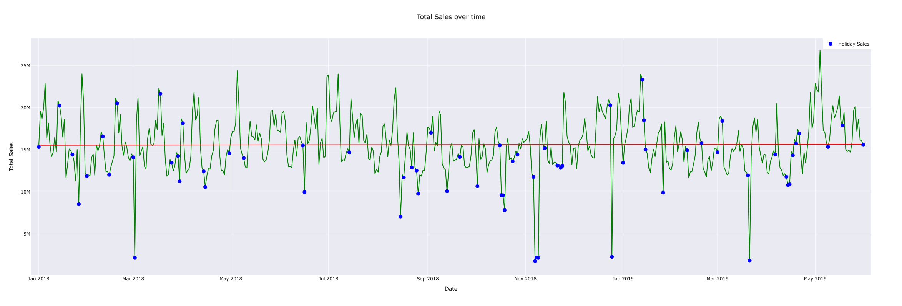
<p class="text-center">Global Time Series</p>

As you can see from the above plot there is no clear trend in the data. The sales data is stationary and does not exhibit any significant upward or downward trend over time. For in-depth analysis, please check the Tableau dashboard linked above.

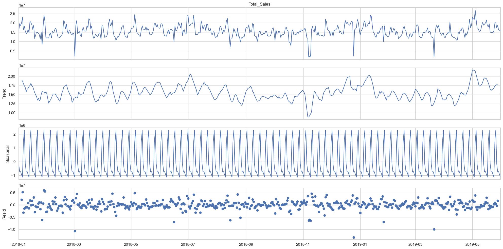
<p class="text-center">Plot of Seasonal Decompose</p>

The above plot shows the seasonal decomposition of the sales data. The data is decomposed into trend, seasonality, and residual components. The trend component represents the long-term movement of the data, while the seasonal component captures the periodic fluctuations. The residual component represents the random noise in the data.  
From the above plot, it is clear that there is no long-term trend in the data. The seasonal component shows that there is a weekly seasonality in the data.

### Seasonality

Have you ever wondered why some days your store is bustling with customers while other days it's eerily quiet? That's the magic of weekly seasonality. Understanding these patterns is crucial for retail businesses to optimize their operations and maximize sales

As with any sales data, multiple seasonal patterns are evident. The most important seasonal pattern is weekly seasonality. Weekends tend to have higher sales as compared to other days. The following plots showcase the different seasonal patterns present in the data.

#### Day of Week Seasonality

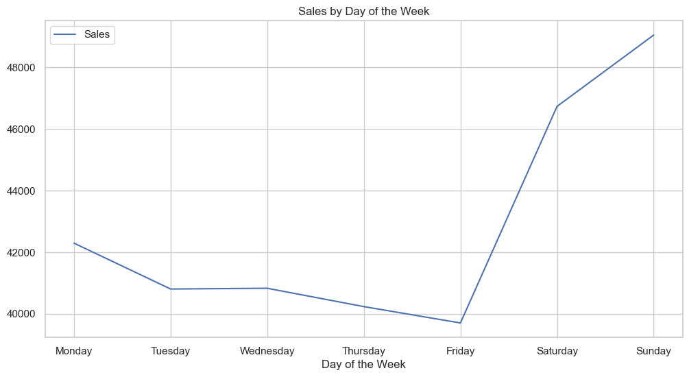

**Observations**

- Sales are highest during Saturday and Sunday
- This can be attributed to the fact that most people are off from work during the weekends and tend to shop more
- Business owners can leverage this information to plan promotions and marketing campaigns during the weekends

#### Day of the Month Seasonality

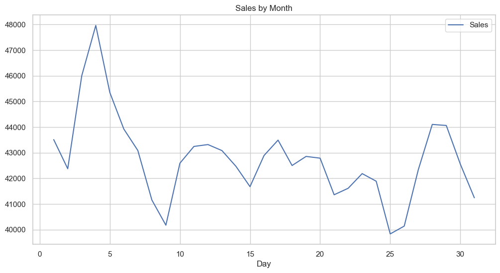

**Observations**

- There is a high number of sales during the first 5 days of the month
- This can be attributed to the fact that most people receive their salaries during the first week of the month
- Business owners can leverage this information to plan promotions and marketing campaigns during the first week of the month

#### Week of the Month Seasonality

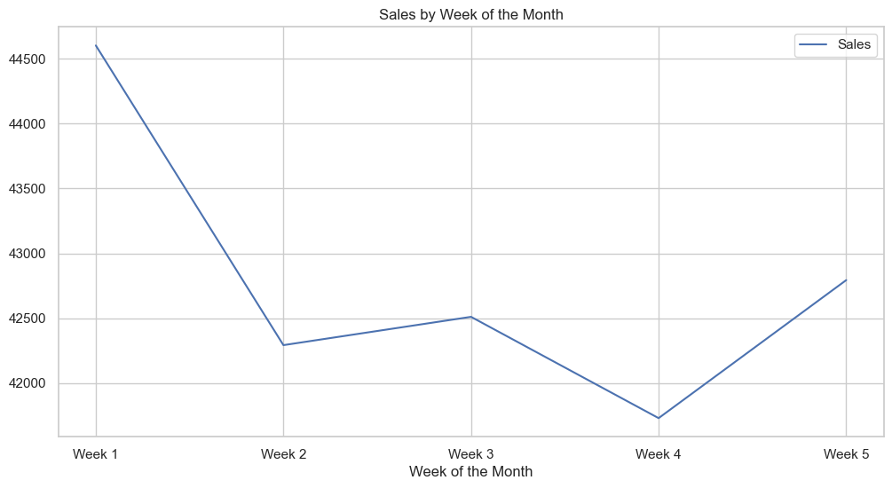

**Observations**

- There is a higher number of sales during the first week of the month
- There is a slight increase in sales during the last week of the month
- The sales are lowest during the 4th week of the month

#### Monthly Seasonality

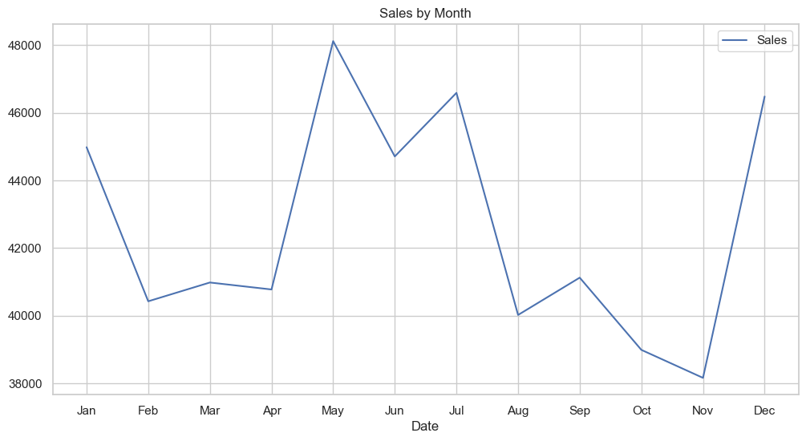

**Observations**

- Sales are highest during May, July, December, and January
- Sales are lowest during October and November

From all the above observations, we can see that there are multiple seasonal patterns in the data. I used these values to create new features for the model to capture the seasonality in the data.

## Hypothesis Testing

Hypothesis testing is a statistical method used to make inferences about a population based on sample data. It involves formulating a null hypothesis (H0) and an alternative hypothesis (H1) and using statistical tests to determine whether the sample data provides enough evidence to reject the null hypothesis in favour of the alternative hypothesis.

<Aside>

### Hypothesis Testing Explained

Imagine you're the manager of a café, and you just introduced a new type of coffee. You claim, "This coffee will increase the average daily number of customers!" However, your sceptical friend says, "Maybe the number of customers is the same as before."

Here’s how you can use hypothesis testing to figure it out:

Start with two ideas (hypotheses):

- **Null Hypothesis (H₀)**: The new coffee doesn't change the number of customers.
- **Alternative Hypothesis (H₁)**: The new coffee increases the number of customers.

**Collect data:**
For a week, you track how many customers come in daily after introducing the new coffee. Let’s say the average used to be 100 customers per day.

**Do the math:**
A statistical test (like a t-test) will compare the new data to the old average of 100 customers. It calculates something called a p-value.

**Understand the p-value:**
The p-value is like a "chance meter." It shows how likely it is that what you're seeing (more customers) is just random luck if your new coffee doesn't actually make a difference.

- A small p-value (0.03) means it's probably not just luck—your coffee is likely making a difference!
- A large p-value (0.4) means it could easily be random, so there's no strong proof that coffee is helping.

**Make a decision:**
You choose a threshold (called significance level, often 0.05).

If the p-value is smaller than 0.05, you reject the null hypothesis and celebrate!
If not, you stick with the null hypothesis and reconsider your coffee strategy.

</Aside>

In this section, I will test several hypotheses related to the sales data to determine whether certain factors have a significant impact on sales. We will be using 0.05 as the significance level for all hypothesis tests. This means that we will reject the null hypothesis if the p-value is less than 0.05.  
I used Levene's test to check the equality of variances and the Shapiro-Wilk test to check the normality of the data before performing the hypothesis tests. All the hypotheses for equal variance failed, so I used
a t-test with `equal_var=False` for all the hypothesis tests. This essentially converts it to Welch's t-test which is more robust to unequal variances.

### Impact of Discounts on Sales

**Hypothesis:** Stores offering discounts will have significantly higher sales than stores not offering discounts.

- **Null Hypothesis:** Stores offering discounts will have the same sales as stores not offering discounts.
- **Alternative Hypothesis:** Stores offering discounts will have significantly higher sales than stores not offering discounts.

**Verdict:** The p-value was found to be 0, which is less than the significance level of 0.05. Therefore, we reject the null hypothesis and accept the alternative hypothesis. This means that stores offering discounts have significantly higher sales than stores not offering discounts.

---

### Effect of Holidays on Sales

**Hypothesis:** Sales on holidays are higher compared to non-holidays.

- **Null Hypothesis:** Sales on holidays are the same as sales on non-holidays.
- **Alternative Hypothesis:** Sales on holidays are higher compared to non-holidays.

**Verdict:** The p-value was found to be 1, which is greater than the significance level of 0.05. Therefore, we fail to reject the null hypothesis. This means that sales on holidays are the same as sales on non-holidays.

---

### Sales Differences Across Store Types

**Hypothesis:** Different store types experience different sales volumes.

- **Null Hypothesis:** Different store types experience the same sales volumes.
- **Alternative Hypothesis:** Different store types experience different sales volumes.

**Verdict:** The p-value was found to be 0 using the Kruskal-Wallis test, which is less than the significance level of 0.05. Therefore, we reject the null hypothesis and accept the alternative hypothesis. This means that different store types experience different sales volumes.

---

### Regional Sales Variability

**Hypothesis:** Different regions experience different sales volumes.

- **Null Hypothesis:** Different regions experience the same sales volumes.
- **Alternative Hypothesis:** Different regions experience different sales volumes.

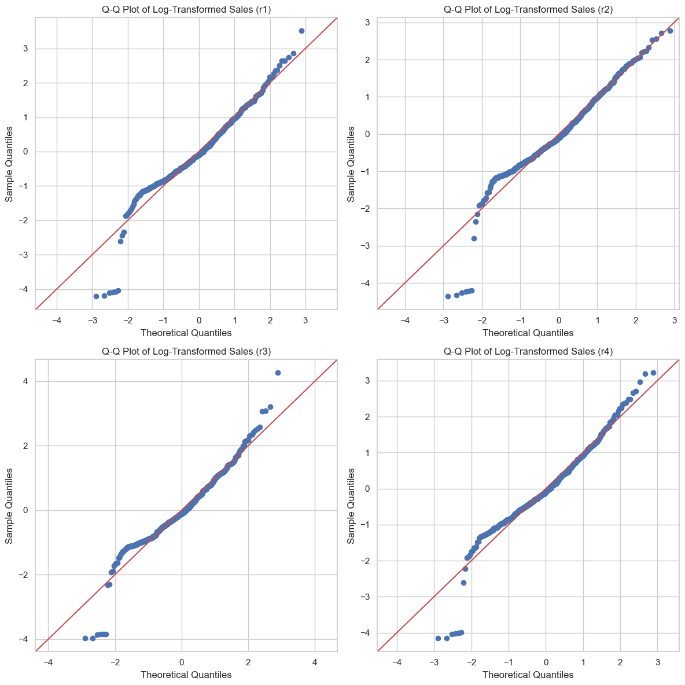

**Observations**

- From the Shapiro test and QQ plot, we can say that the data is not normally distributed. Hence, we will use a non-parametric test to check if the sales volumes are different across different regions.
- We will use the Kruskal-Wallis test to check if the sales volumes are different across different regions.

**Verdict:** The p-value for the Kruskal-Wallis test was 0, which is less than the significance level of 0.05. Therefore, we reject the null hypothesis and accept the alternative hypothesis. This means that different regions experience different sales volumes.

---

### Correlation between Number of Orders and Sales

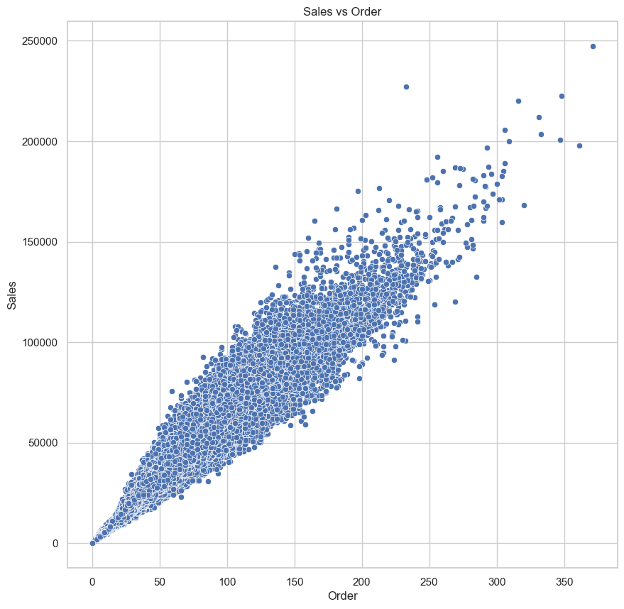

**Observations**

- From the above plot we can see that there is a positive correlation between the number of orders and sales. This means that as the number of orders increases, sales also increase.

The code for hypothesis testing can be found in the notebook linked below.

[](https://nbviewer.org/github/gautamnaik1994/SalesForecasting_ML_CaseStudy/blob/main/notebooks/eda/02.HypothesisTesting.ipynb?flush_cache=true)

## Business Insights and Recommendations

1. **Promotional Strategies**: The analysis revealed that stores offering discounts have significantly higher sales than stores not offering discounts. Business owners can leverage this insight to develop targeted promotional strategies, such as discount offers, to boost sales and attract more customers.
2. **Seasonal Marketing Campaigns**: The time series analysis identified weekly and monthly seasonality patterns in the sales data. Business owners can use this information to plan seasonal marketing campaigns and promotions during peak sales periods to maximize revenue.
3. **Regional Expansion**: The analysis revealed significant differences in sales volumes across different store types and regions. Business owners can use this information to identify high-performing regions and store types and consider expanding their operations in these areas to capitalize on the demand.
4. **Inventory Management**: Understanding the impact of holidays on sales can help businesses optimize their inventory management processes. By anticipating increased demand during holidays, retailers can ensure they have sufficient stock to meet customer needs and avoid stockouts.
5. **Customer Engagement**: The positive correlation between the number of orders and sales highlights the importance of customer engagement and retention. Business owners can focus on building strong customer relationships, providing excellent service, and offering personalized shopping experiences to increase customer loyalty and drive sales.
6. **Data-Driven Decision Making**: By leveraging data analytics and machine learning models, businesses can make informed decisions based on data-driven insights. This can help optimize operations, improve forecasting accuracy, and drive business growth in a competitive retail environment.
7. **Future Scope**: The analysis provides a solid foundation for future research and improvement. Businesses can explore advanced forecasting techniques, such as hierarchical forecasting and ensemble models, to enhance the accuracy and robustness of their sales forecasting systems.

## Clustering

Clustering is an unsupervised machine-learning technique used to group similar data points together based on their features. It is commonly used for customer segmentation, anomaly detection, and pattern recognition.

### Why Clustering?

#### Building Models for Each Cluster

The dataset contained 365 stores, so building 365 individual models was not feasible. Clustering stores based on sales data was considered, with the goal of building a single model for each cluster. However, this approach was abandoned due to the inability to achieve a clear separation of clusters using KMeans clustering.

Following is the plot generated using KMeans clustering

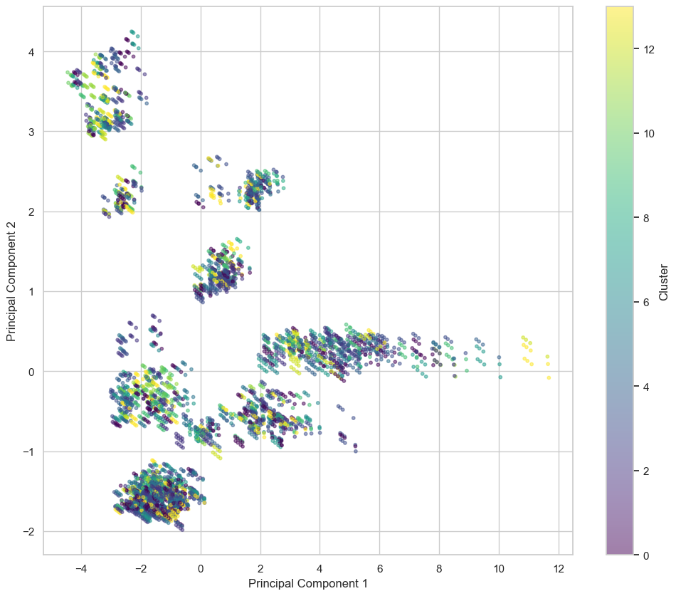

#### For Feature Engineering

I wanted to incorporate some information about the stores into the model, but I also wanted to avoid data leakage, which can be a potential issue with target encoding on Store IDs.
I attempted to use hierarchical clustering to generate clusters and then use the cluster ID as a feature in the model, but this approach was not successful. In the end, I used both target encoding on Store IDs and cluster IDs as features in the model. As you'll see in the feature importance plot provided in the following sections, cluster ID had the least feature importance.

Following is the plot generated using Hierarchical clustering

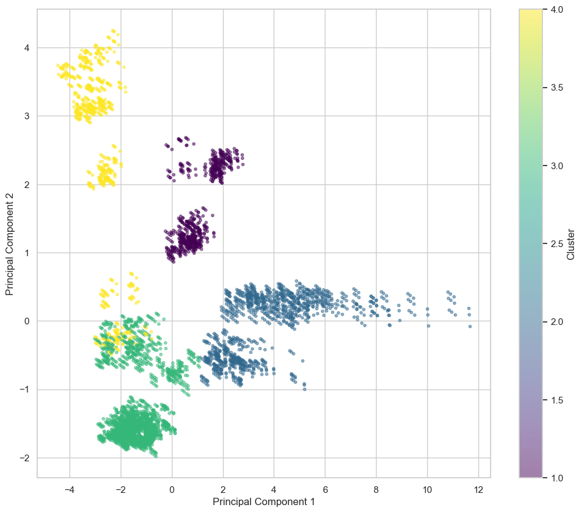

### Post Clustering Analysis

After clustering the stores, I performed a post-clustering analysis to understand the characteristics of each cluster and identify any patterns or trends that could inform the forecasting model. This is done by aggregating the sales data for each cluster and analyzing the average sales, sales growth, and other relevant metrics.

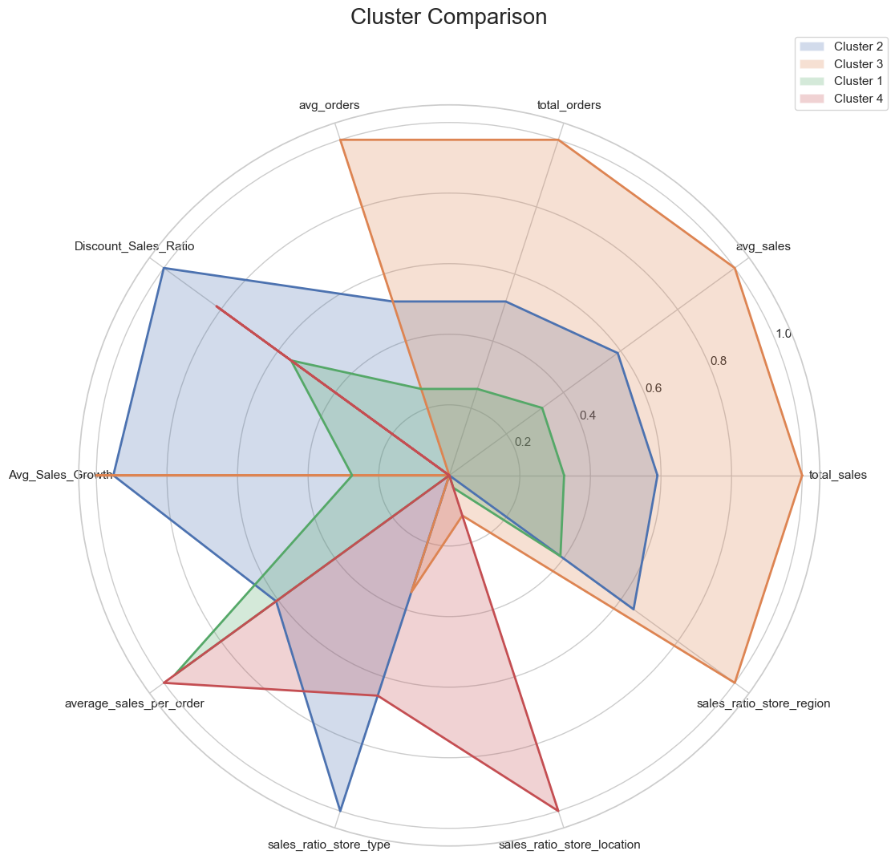

The above polar plot shows the averaged data for each cluster. We can see that stores belonging to Cluster 2 have high average sales growth while stores belonging to Cluster 3 have high average sales.

Code for generating data required to build dataset for clustering can be found in the notebook linked below.

[](https://nbviewer.org/github/gautamnaik1994/SalesForecasting_ML_CaseStudy/blob/main/notebooks/data_processing/02.DataGeneration.ipynb?flush_cache=true)

<p/>

The code for the clustering can be found in the notebook linked below.

[](https://nbviewer.org/github/gautamnaik1994/SalesForecasting_ML_CaseStudy/blob/main/notebooks/data_processing/03.Clustering.ipynb?flush_cache=true)

## Prediction and Forecasting

Businesses rely on planning for success, which necessitates an understanding of future trends. While past sales data has offered valuable insights, we will now utilize machine learning algorithms to predict future sales.

Traditional statistical and econometric models, while valuable in certain contexts, are often limited in their ability to capture the complexities and nuances of real-world sales data. These models typically assume fixed patterns and relationships, which may not always hold true in practice. Machine learning algorithms, on the other hand, are designed to learn and adapt from data, allowing them to identify and model even the most intricate patterns and trends.

In the context of sales forecasting, machine learning algorithms can be employed at various levels of granularity. For example, these algorithms can be used to generate store-level sales predictions, taking into account factors such as local market conditions, demographics, and competitor activity. At the regional or global level, statistical time series models may be more appropriate, as they can capture broader economic trends and seasonality effects.

By combining the strengths of machine learning algorithms and statistical time series models, businesses can develop robust and comprehensive sales forecasting systems. These systems can provide valuable insights into future sales patterns, enabling businesses to anticipate changes in demand, optimize inventory levels, and allocate resources effectively. Ultimately, the ability to accurately forecast sales can give businesses a significant competitive advantage, allowing them to stay ahead of the curve and achieve sustainable growth.

In the following sections, I will delve deeper into the models and forecasting techniques used in this project, as well as the metrics and feature engineering strategies employed to optimize the predictive performance.

### Machine Learning Models

When utilizing Machine Learning (ML) algorithms for time series forecasting, it's essential to understand that the data cannot be used in its raw format. ML algorithms typically require training data structured as 'n' rows and 'm' columns, along with corresponding target data with 'n' rows and one or more columns, depending on the specific algorithm.

In the simplest time series forecasting scenario, today's data would serve as the training input, and the model would predict tomorrow's value as the target output. However, to enhance the model's ability to capture underlying patterns and trends within the time series data, it's common practice to utilize a window of past data. For instance, using the previous 30 days of data as input features allows the model to learn from recent historical behavior and make more informed predictions about future values.

This process of transforming time series data into a suitable format for ML algorithms often involves feature engineering techniques, such as creating lagged features, rolling window statistics, and incorporating time-based features like day of the week or month of the year. These additional features can provide valuable context and improve the model's predictive performance.

We will go into detail about this in the upcoming Feature Engineering section.

#### Models Explored

During my experiments, I tried various machine learning algorithms, including Linear Regression, Random Forest, XGBoost, and LightGBM to forecast sales data.

##### Linear Regression

Linear Regression is a simple and interpretable model that can capture linear relationships between features and the target variable. However, it struggled to capture the complex patterns and non-linear relationships present in the data.

##### ElasticNet

ElasticNet is a variant of Linear Regression that combines L1 and L2 regularization. It was tested but did not yield significant performance improvements.

##### Random Forest

Random Forest is an ensemble learning algorithm that builds multiple decision trees and combines their predictions to produce a final output. While Random Forest performed better than Linear Regression, it
took a long time to train and was not as accurate as XGBoost and LightGBM.

##### XGBoost

XGBoost is an optimized distributed gradient boosting library designed for speed and performance. It gave good results but was inconsistent in terms of duration of training. Sometimes it took a long time to train, and sometimes it was faster.

##### LightGBM

LightGBM is a gradient-boosting framework that uses tree-based learning algorithms. It is known for its speed and efficiency, making it a popular choice for time series forecasting tasks. It consistently outperformed the other algorithms in terms of speed and accuracy. It provided almost similar MAE(Mean Absolute Error) as XGBoost but was faster in training.

Eventually, I settled on using LightGBM as the primary model for sales forecasting due to its superior performance and efficiency.

All the code for the above models can be found in the following notebook:

[](https://nbviewer.org/github/gautamnaik1994/SalesForecasting_ML_CaseStudy/blob/main/notebooks/modelling/04.MLAlgos.ipynb?flush_cache=true)

#### Metric

I used Mean Absolute Error (MAE) as the evaluation metric for the models. MAE is the average of the absolute differences between the predicted and actual values. It gives us an idea of how far off our predictions are from the actual values. The lower the MAE, the better the model's performance.  
The standard deviation of the sales was 18084, so an MAE between 5000 and 10000 was considered a good value.

#### Forecasting Techniques

When it comes to Forecasting techniques using ML algorithms there are multiple ways to forecast the sales data. The following are the techniques:

**Single-step Forecasting**

Single-step forecasting is a forecasting technique that involves predicting one future time step at a time. In the context of this project, it would mean using the data from the previous 30 days to forecast the sales for the next day.  
This is a simple and straightforward approach that can be effective for short-term forecasting.

**Multi-step Forecasting**

Multi-step forecasting is a forecasting technique that involves predicting multiple future time steps simultaneously. In the context of this project, it would mean using the data from the previous 30 days to forecast the sales for the next 7 days.  
This can be done by training a separate model for each day ie. training a model for day 1, training another model for day 2 and so on. This is computationally expensive and not feasible for this project as it requires training and maintaining 7 models.

**Multi-output Forecasting**

This is computationally less expensive compared to multi-step forecasting as we train a single model to predict multiple days in the future.  
In the context of this project, it would mean using the data from the previous 30 days to forecast the sales for the next 7 days. This is a more advanced technique compared to single-step forecasting (predicting one-time step ahead) and often requires additional feature engineering and more complex models. One can use MultiOuput Regressor from sklearn to implement this if the algorithm doesn't support multi-output forecasting natively.  
Here is the link to the documentation: [MultiOutput Regressor](https://scikit-learn.org/stable/modules/generated/sklearn.multioutput.MultiOutputRegressor.html)

**Recursive Forecasting**

Recursive forecasting is a methodology that utilizes historical data to predict future values. The model uses the data from the preceding 30 days to forecast the next day's value. It is an extension of single-step forecasting but is applied iteratively to predict multiple future values.  
If a projection for multiple days in the future is required, **the predicted value for the next day must be used as input for the subsequent day's prediction**, and this process is repeated for each successive day. This iterative process is known as recursion.  
While recursive forecasting can be effective, it is essential to note that the accuracy of the predictions can degrade with each iteration. This is due to the fact that each prediction is based on a previous prediction, and any errors in the initial prediction will be compounded in subsequent predictions.
Therefore, while recursive forecasting can be a valuable tool for short-term forecasting, it may not be suitable for long-term forecasting due to the potential for accumulating errors.

The code for Recursive forecasting can be found in the notebook linked below.

[](https://nbviewer.org/github/gautamnaik1994/SalesForecasting_ML_CaseStudy/blob/main/notebooks/modelling/05.MLAlgo_RecursiveForecasting.ipynb?flush_cache=true)

<p/>

<ExpandableSeeMore>

Following is the code snippet from Streamlit app for Recursive Forecasting.

```python
# ...load models and data first

def transform_predict(data):
  data = data.copy()
  data.loc[:, "Store_id_enc"] = target_encoder.transform(data[["Store_id"]])
  data = pipeline.transform(data) # Transform the data using the pipeline
  return lgbm.predict(data.reshape(1, -1))[0] # Predict the sales using the trained LightGBM model

def forecast(Store_id, days=60):
  forecast_df = deploy_data[deploy_data["Store_id"] == Store_id]
  train_data_slice = train_data[train_data["Store_id"] == Store_id][["Date", "Sales", "Store_id"]]
  editable_data = forecast_df.copy()
  predictions = []

  for i in range(0, days):
    last_31_data = editable_data.iloc[i:i+31] # Get the last 31 days of data
    prediction_date = last_31_data.iloc[-1]["Date"]
    prediction = transform_predict(last_31_data) # Here the new data is transformed and predicted
    # Append the prediction to the list
    predictions.append({
      "Date": prediction_date,
      "Sales": prediction
    })
    # Update the data with the prediction
    editable_data.loc[editable_data["Date"] == prediction_date, "Sales"] = prediction

  # Create a DataFrame from the predictions
  prediction_df = pd.DataFrame(predictions)
  prediction_df["Store_id"] = Store_id
  prediction_df["Type"] = "Forecasted"
  train_data_slice["Type"] = "Current"
  # Concatenate the past data and the predictions
  return pd.concat([train_data_slice, prediction_df], axis=0)
```

</ExpandableSeeMore>

#### Feature Engineering

**Lag Features**

The time series analysis revealed multiple seasonalities within the data. To address this, I incorporated a 1-day lag, 7-day lag, 12-day lag, and 30-day lag as features. From these lag values, I derived the following features:

1. Sales lag for each lag value
2. Rolling mean of Sales for each lag value
3. Rolling standard deviation of Sales for each lag value
4. Minimum and Maximum Sales in each lag period
5. Expanding weighted mean of Sales from the start of the data till the last available date
6. Expanding weighted standard deviation of Sales from the start of the data till the last available date
7. Expanding the weighted sum of Sales from the start of the data till the last available date

**Date Features**

1. Day of the week
1. Day of the month
1. Week of the month
1. Month
1. Quarter

Since the above date features are cyclical, I used sin and cos
transformation to convert them into linear features. Doing this helps the model
to understand the cyclical nature of the features.
for eg.

```python
  df['Day_sin'] = np.sin(2 * np.pi * df['Day']/31)
  df['Day_cos'] = np.cos(2 * np.pi * df['Day']/31)
```

**Other Features**

1. Is Weekend
1. Is Holiday

The above 2 features play a very important role in sales forecasting. Sales are generally higher during weekends and holidays, so these features can help the model capture the seasonality in the data.

#### Plots

**Feature Importance**

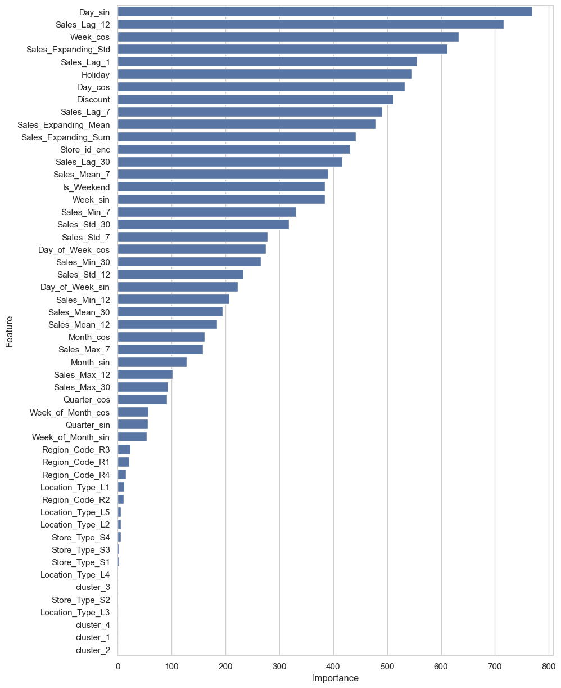

From the above plot, we can see that the most important feature is the 1-day lag feature. This means that the sales on the previous day have the most impact on the sales for the current day.

**Model Interpretation Plot**

Model interpretation is different from feature importance. Feature importance tells us how much each feature contributes to the model's predictions, while model interpretation tells us how each feature affects the model's predictions.
A Python package called [shap](https://shap.readthedocs.io/en/latest/) is used to interpret the model.

Following is the code used to generate the model interpretation plot:

```python
import shap

fig, ax = plt.subplots(figsize=(10, 5))

# following data is test dataframe
transformed_forecast_df = pd.DataFrame(transformed_forecast_data, columns=pipeline[1].get_feature_names_out())
# Generate SHAP values
explainer = shap.TreeExplainer(lgbm)
# get the first row of the test data
shap_values = explainer.shap_values(transformed_forecast_data[0].reshape(1, -1))

# Create the SHAP waterfall plot
shap.waterfall_plot(
    shap.Explanation(
        values=shap_values[0],
        base_values=explainer.expected_value,
        data=transformed_forecast_df.iloc[0, :],
        feature_names=transformed_forecast_df.columns
    ),
    max_display=15,
    show=False
)

# Set the title and show the plot
plt.title(f"SHAP Waterfall Plot for Store ID {forecast_df['Store_id'].iloc[0]}")
plt.show()
```

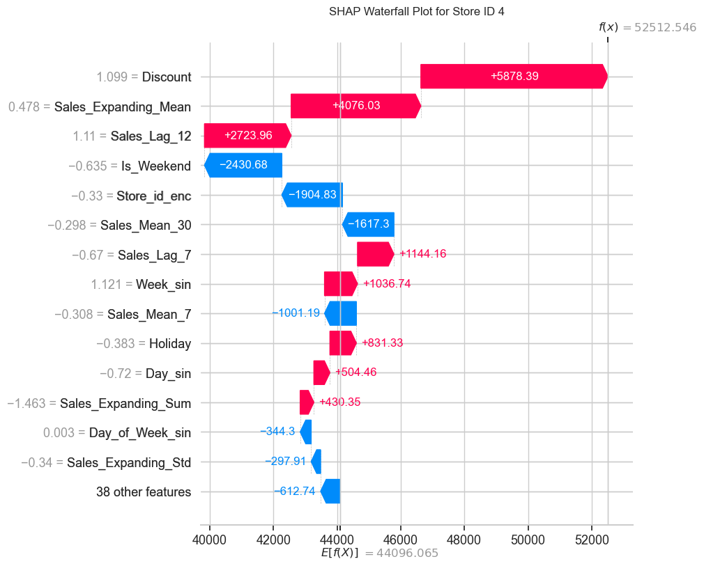

From the above plot, we can see that `Discount` had a positive impact on the sales, while `Is Weekend` had a negative impact on the sales.  
Upon inspecting the data, I confirmed that on the above date, It **was a Discount day** and also it was **not a Weekend**. This explains the positive impact of 'Discount' and the negative impact of 'Is Weekend' on sales.  
This is how I can verify the model's predictions and understand the impact of each feature on the model's predictions.

**Actual vs. Predicted**

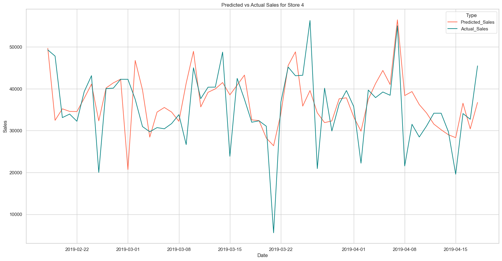
<p class="text-center">Actual vs Predicted Sales</p>

From the above plot, we can see that the model can predict the sales approximately. However, it couldn't predict the dips accurately.

**Residuals**

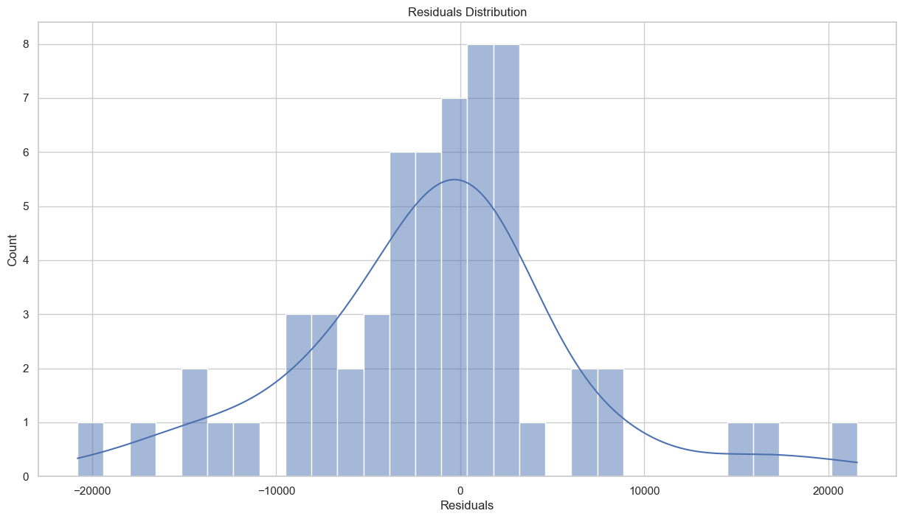

From the above plot, we can see that the residuals are normally distributed.  
Normality of residuals is a key diagnostic check for the validity of a time series model. If the residuals are not normally distributed, it may indicate that the model is misspecified (e.g., missing important variables, incorrect functional form, or inadequate handling of seasonality or trends).  
Non-normality in residuals can also suggest the presence of outliers or structural breaks in the data.

#### Model Evaluation

<div className="side-scrolling-table-container">
<table>
  <thead>
    <tr>
      <th width="70%">Model</th>
      <th width="30%">MAE</th>
    </tr>
  </thead>
  <tbody>
    <tr>
      <td>Linear Regression</td>
      <td>7118.54</td>
    </tr>
    <tr>
      <td>ElasticNet</td>
      <td>6956.83</td>
    </tr>
    <tr>
      <td>Random Forest</td>
      <td>6515.05</td>
    </tr>
    <tr>
      <td>XGBoost</td>
      <td>6431.14</td>
    </tr>
    <tr>
      <td>LightGBM</td>
      <td>6107.66</td>
    </tr>
  </tbody>
</table>
</div>

From the above table, we can see that LightGBM performed the best in terms of MAE. Compared to linear models, tree-based models like XGBoost and LightGBM are better at capturing non-linear relationships and interactions between features, making them more suitable for time series forecasting tasks.

### Time Series Models

Time series forecasting is a method used to predict future values based on historical data. It involves analyzing the patterns and trends in the data to make informed predictions about future values.  
In this project, I used various time series models to forecast sales data at different levels of granularity, including global, regional, and store-level sales.  
Unlike traditional machine learning models, time series models are specifically designed to handle time-dependent data and capture the underlying patterns and seasonality present in the data.

#### Models Explored

##### Triple Exponential Smoothing (Holt-Winters)

The model incorporates level, trend, and seasonality components, making it suitable for time series data exhibiting these characteristics. It was employed to forecast both global and regional sales data.

However, this model wasn't used for store-level sales data due to the presence of 365 stores. Applying the model to each store would be computationally expensive and result in 365 separate models, which would be cumbersome to maintain and deploy.

All the code for the above models can be found in the following notebook:

[](https://nbviewer.org/github/gautamnaik1994/SalesForecasting_ML_CaseStudy/blob/main/notebooks/modelling/01.HoltWinterMethod.ipynb?flush_cache=true)

##### ARIMA, MSTL and MFLES

For the above models, I used a package called [Nixtla StatsForecast](https://nixtlaverse.nixtla.io/statsforecast/index.html). They supported exogenous variables and multiple seasonalities.
One of their model [MFLES](https://nixtlaverse.nixtla.io/statsforecast/docs/models/mfles.html) is a simple time series method based on gradient boosting time series decomposition.
The problem with this package was that there were many models to choose from and it was difficult to understand which model to use for the data. I will be researching more about this package and will be using it in future projects.

All the code for the above ARIMA, MSTL and MFLES models can be found in the following notebook:

[](https://nbviewer.org/github/gautamnaik1994/SalesForecasting_ML_CaseStudy/blob/main/notebooks/modelling/02.SARIMAX.ipynb?flush_cache=true)

##### Facebook Prophet

Prophet is a forecasting tool developed by Facebook that is designed for analyzing time series data with daily observations that display patterns on different time scales. It is robust to missing data and shifts in the trend, and it provides intuitive parameters that are easy to interpret.
I used this model to forecast the global sales data and region-level sales data. Out of all above time series models, Prophet performed the best in terms of MAPE and speed in training

All the code for the above models can be found in the following notebook:

[](https://nbviewer.org/github/gautamnaik1994/SalesForecasting_ML_CaseStudy/blob/main/notebooks/modelling/03.Prophet.ipynb?flush_cache=true)

##### Feature Engineering

The dataset included discount dates for various stores, and I needed to aggregate this data at the regional level to create a new feature called 'Total_Discount', representing the total number of discounts offered in a region on any given day. This was necessary because I was forecasting for regional and global sales, which required aggregating the data at those levels.

#### Metric

The models were assessed using the Mean Absolute Percentage Error (MAPE), which measures forecasting accuracy by averaging the absolute percentage errors between predicted and actual values. Lower MAPE values indicate better model performance.  
The goal was to achieve a MAPE value below 10%, but the models only reached a MAPE value of approximately 15%.

#### Plots

**Residuals**

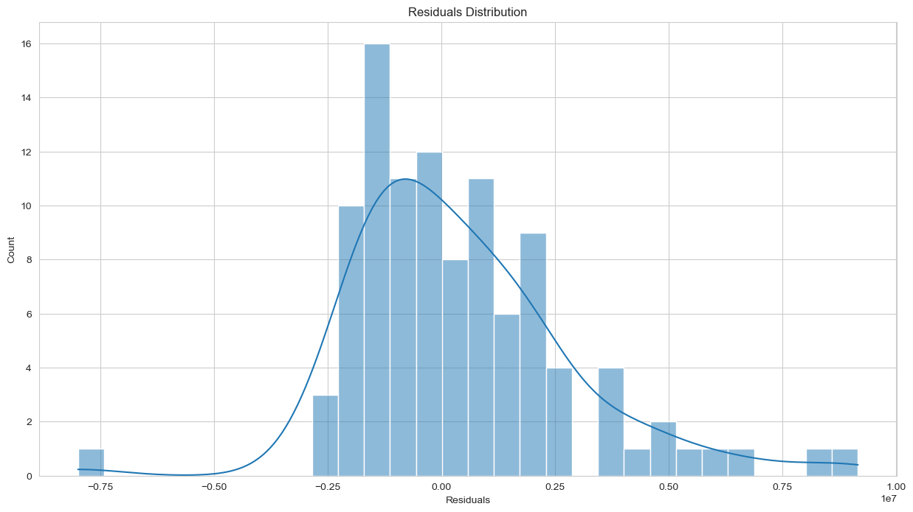

From the above plot, we can see that there is slight right skewness in the residuals. This indicates that the model is underestimating the sales values.

**Actual vs. Predicted**

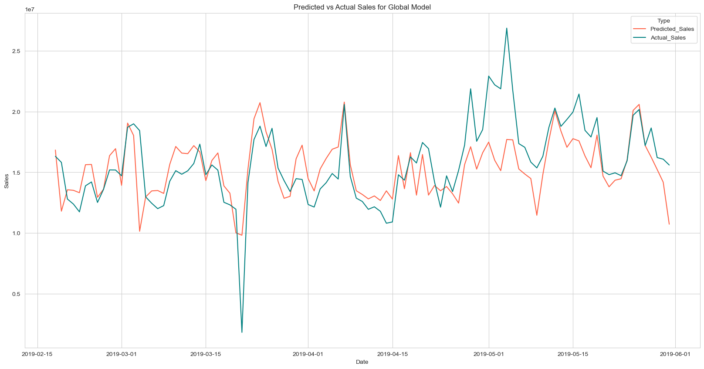
<p class="text-center">Actual vs Predicted Global Sales</p>

#### Model Evaluation

<div className="side-scrolling-table-container">
<table>
  <thead>
    <tr>
      <th>Model</th>
      <th>Region MAPE</th>
      <th>Global MAPE</th>
    </tr>
  </thead>
  <tbody>
    <tr>
      <td>Facebook Prophet</td>
      <td>13% - 16%</td>
      <td>14%</td>
    </tr>
    <tr>
      <td>Triple Exponential Smoothing</td>
      <td>17% - 20%</td>
      <td>19%</td>
    </tr>
    <tr>
      <td>ARIMA</td>
      <td>17%</td>
      <td>17%</td>
    </tr>
    <tr>
      <td>MSTL</td>
      <td>17%</td>
      <td>16%</td>
    </tr>
    <tr>
      <td>MFLES</td>
      <td>15%</td>
      <td>18%</td>
    </tr>
  </tbody>
</table>
</div>

From the above table, we can see that the Facebook Prophet model performed the best in terms of MAPE for both regional and global sales forecasting. This may be because Facebook Prophet can capture multiple seasonalities and also handles exogenous variables well.  
I believe that the performance of MSTL and MFLES could have been improved with more tuning and hyperparameter optimization.

### Hierarchical Forecasting

Hierarchical forecasting is a method used to forecast sales data at multiple levels of aggregation. In the context of this project, hierarchical forecasting can be used to predict sales at different levels of granularity, such as:

- Individual Store Level
- Region Level
- Global Level

Hierarchical forecasting is further divided into 3 main types:

**Top-Down Approach**

In this approach, the forecast for the highest level of aggregation (e.g., global sales) is generated first, and then the forecast is disaggregated to lower levels of aggregation (e.g., regional and store-level sales) based on historical proportions or other allocation methods.

**Bottom-Up Approach**

In this approach, the forecast for the lowest level of aggregation (e.g., individual store sales) is generated first, and then the forecast is aggregated to higher levels of aggregation (e.g., regional and global sales) based on the sum of the lower-level forecasts.

**Middle-Out Approach**

In this approach, the forecast for the middle level of aggregation (e.g., regional sales) is generated first, and then the forecast is disaggregated to lower levels of aggregation (e.g., individual store sales) and aggregated to higher levels of aggregation (e.g., global sales).

I will be using these techniques as part of future improvements to the model.

## Hyperparameter Tuning and Experiment Tracking

Hyperparameter tuning is the process of finding the best hyperparameters for a
model. Grid Search and Random Search are the most common methods for
hyperparameter tuning. However, these methods are computationally expensive and
time-consuming. This is the reason, I chose [Optuna](https://optuna.org/) for hyperparameter tuning.
Along with Optuna, I used [MLflow](https://mlflow.org/) for tracking the experiments.
I have explained in detail about MLflow and Optuna in the next section.

### Optuna

Optuna is a hyperparameter optimisation framework that uses
[Bayesian Optimization](https://en.wikipedia.org/wiki/Bayesian_optimization) to
find the best hyperparameters for a model. Optuna optionally saves information
about all the trails in a local SQLite database. It also provides a web UI to
visualize the trails. Using this web UI, we can compare different trails and also
show which hyperparameters are important.

Following are some screenshots of the Optuna Dashboard. Notice how the dashboard provides a detailed view of the minimization process, including the best hyperparameters and their corresponding values.

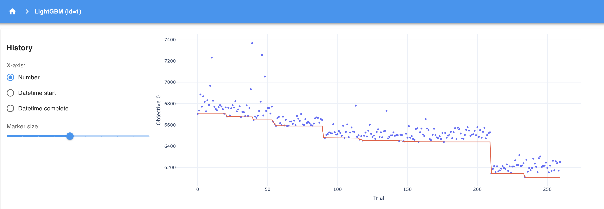
<p class="text-center">Optuna Timeline</p>

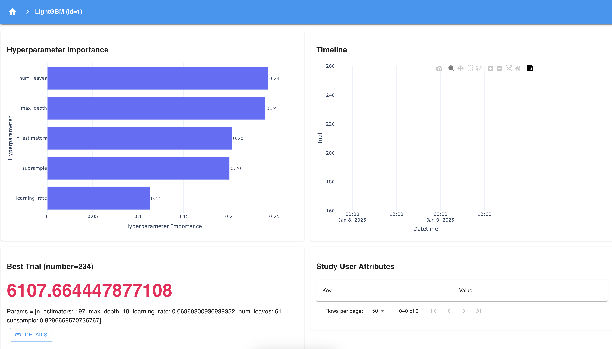
<p class="text-center">Hyperparameter Importance</p>

### MLflow

Whenever I work on ML projects, It quickly gets messy with multiple experiments, models,
and hyperparameters. Even the Jupyter Notebook gets cluttered with numerous
cells. This is where MLflow comes in. MLflow can help you
track your experiments, models, and hyperparameters when set up correctly. It also helps you to log
the metrics, parameters, and artefacts. It also helps you to compare the
experiments and models. It also helps you to reproduce the results.

Following are some screenshots of the MLflow UI. Notice how the dashboard provides a detailed view of the experiments, including the metrics, parameters, and artefacts.

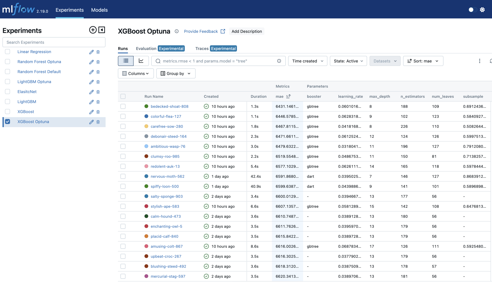
<p class="text-center">MLFlow Dashboard</p>

## Deployment using Streamlit

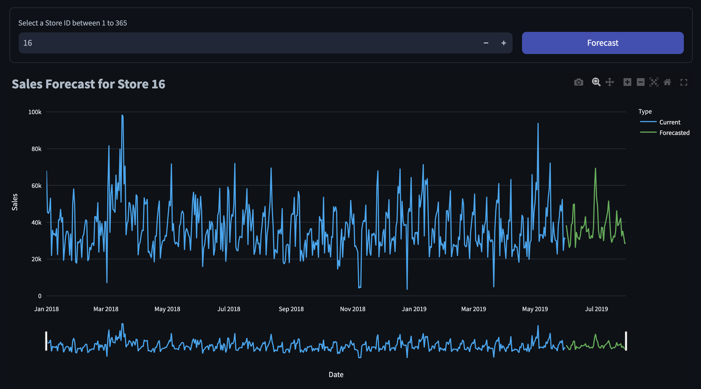

I used Streamlit to deploy the model as a web application. Streamlit is an open-source app framework for Machine Learning and Data Science projects. It allows you to create interactive web applications directly from your Python scripts.

The Streamlit app provides the following functionalities:

- Global Sales Forecasting
- Regional Sales Forecasting
- Store Sales Forecasting

The code for the Streamlit app can be found [here](https://github.com/gautamnaik1994/SalesForecasting_ML_CaseStudy/tree/main/deploy)

<Alert variant="info">
  If the app is inactive for a while, Streamlit may shut it down. To restart the app, click on the "Yes, get this app back up!" button.
</Alert>

Click the following button to view the Streamlit app

[](https://sales-forecasting-gn.streamlit.app/)

### Pipeline Flow Diagram

Time series forecasting models like Facebook Prophet need details of future data like holidays, and discount days to predict future sales. Similarly, ML models need the past 30 days' data to predict future sales.
For predicting store sales, I could have used directly used the cleaned data, but in order to simulate the real-world scenario, I have created a pipeline that takes the raw data, cleans it, and then predicts the sales.

Following is the flow diagram of the pipeline. It's built using [https://www.eraser.io/](https://www.eraser.io/) diagram as a code tool. The diagram code for the pipeline can be found in the [here](https://github.com/gautamnaik1994/SalesForecasting_ML_CaseStudy/blob/main/misc/ml_pipeline_arc.eraserdiagram).

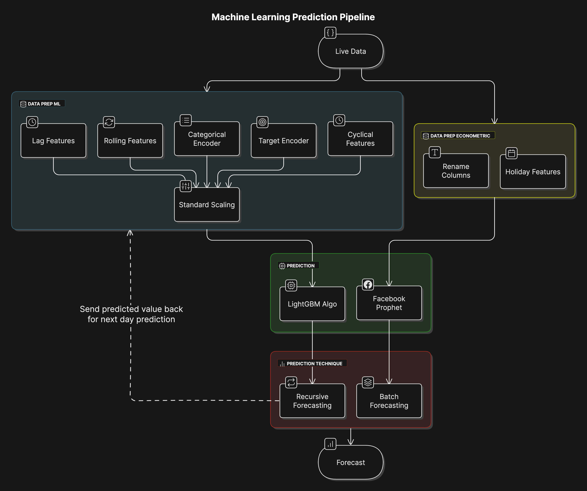
<p class="text-center">ML Prediction Pipeline</p>

### Pipeline Implementation

Following is the snippet of the code for building the pipeline using scikit-learn and LightGbm ML algorithm used for predicting individual stores sales.

<ExpandableSeeMore>

```python
from sklearn.base import BaseEstimator, TransformerMixin
from sklearn.pipeline import Pipeline

class FeatureGenerator(BaseEstimator, TransformerMixin):
    def __init__(self):
        self.dropped_indices_ = None  # To store the indices of dropped rows
        self.included_indices_ = None  # To store the indices of included rows

    def fit(self, X, y=None):
        return self

    def transform(self, X):
        result = X.copy()
        result = result.drop(columns=['ID', 'Orders'], axis=1, errors='ignore')
        result = result.sort_values(by=['Store_id', 'Date'])
        # result = result.merge(clusters, on='Store_id', how='left')
        result['Day'] = result['Date'].dt.day
        result["Day_of_Week"] = result["Date"].dt.dayofweek
        result["Month"] = result["Date"].dt.month
        result["Year"] = result["Date"].dt.year
        result["Quarter"] = result["Date"].dt.quarter
        result["Week"] = result["Date"].dt.isocalendar().week
        result["Week_of_Month"] = result["Date"].dt.day.apply(lambda x: (x-1) // 7 + 1)
        result["Is_Weekend"] = result["Day_of_Week"].apply(lambda x: 1 if x >= 5 else 0)
        result["Discount"] = result["Discount"].apply(lambda x: 1 if x == 'Yes' else 0)

        # Create lag features
        result['Sales_Lag_1'] = result.groupby('Store_id')['Sales'].shift(1)
        result['Sales_Lag_7'] = result.groupby('Store_id')['Sales'].shift(7)
        result['Sales_Lag_12'] = result.groupby('Store_id')['Sales'].shift(12)
        result['Sales_Lag_30'] = result.groupby('Store_id')['Sales'].shift(30)

        # Create moving average features
        result['Sales_Mean_7'] = result.groupby('Store_id')['Sales'].shift(1).rolling(window=7).mean()
        result['Sales_Mean_12'] = result.groupby('Store_id')['Sales'].shift(1).rolling(window=12).mean()
        result['Sales_Mean_30'] = result.groupby('Store_id')['Sales'].shift(1).rolling(window=30).mean()

        # Create moving standard deviation features
        result['Sales_Std_7'] = result.groupby('Store_id')['Sales'].shift(1).rolling(window=7).std()
        result['Sales_Std_12'] = result.groupby('Store_id')['Sales'].shift(1).rolling(window=12).std()
        result['Sales_Std_30'] = result.groupby('Store_id')['Sales'].shift(1).rolling(window=30).std()

        # Create moving min and max features
        result['Sales_Min_7'] = result.groupby('Store_id')['Sales'].shift(1).rolling(window=7).min()
        result['Sales_Min_12'] = result.groupby('Store_id')['Sales'].shift(1).rolling(window=12).min()
        result['Sales_Min_30'] = result.groupby('Store_id')['Sales'].shift(1).rolling(window=30).min()

        result['Sales_Max_7'] = result.groupby('Store_id')['Sales'].shift(1).rolling(window=7).max()
        result['Sales_Max_12'] = result.groupby('Store_id')['Sales'].shift(1).rolling(window=12).max()
        result['Sales_Max_30'] = result.groupby('Store_id')['Sales'].shift(1).rolling(window=30).max()


        # Create expanding mean and standard deviation features
        result['Sales_Expanding_Mean'] = result.groupby('Store_id')['Sales'].shift(1).ewm(alpha=0.9, adjust=False).mean()
        result['Sales_Expanding_Std'] = result.groupby('Store_id')['Sales'].shift(1).ewm(alpha=0.9, adjust=False).std()
        result['Sales_Expanding_Sum'] = result.groupby('Store_id')['Sales'].expanding().sum().shift(1).reset_index(level=0, drop=True)

        result = result.drop(columns=["Date","Store_id"], axis=1)
        # encode cyclical features
        result['Day_sin'] = np.sin(2 * np.pi * result['Day']/31)
        result['Day_cos'] = np.cos(2 * np.pi * result['Day']/31)

        result['Day_of_Week_sin'] = np.sin(2 * np.pi * result['Day_of_Week']/6)
        result['Day_of_Week_cos'] = np.cos(2 * np.pi * result['Day_of_Week']/6)

        result['Month_sin'] = np.sin(2 * np.pi * result['Month']/12)
        result['Month_cos'] = np.cos(2 * np.pi * result['Month']/12)

        result['Quarter_sin'] = np.sin(2 * np.pi * result['Quarter']/4)
        result['Quarter_cos'] = np.cos(2 * np.pi * result['Quarter']/4)

        result['Week_sin'] = np.sin(2 * np.pi * result['Week']/52)
        result['Week_cos'] = np.cos(2 * np.pi * result['Week']/52)

        result['Week_of_Month_sin'] = np.sin(2 * np.pi * result['Week_of_Month']/5)
        result['Week_of_Month_cos'] = np.cos(2 * np.pi * result['Week_of_Month']/5)

        # drop original cyclical features
        result = result.drop(columns=['Day', 'Day_of_Week', 'Month', 'Quarter', 'Week', 'Week_of_Month', 'Year', 'Sales'], axis=1)
        
        self.dropped_indices_ = result.index[result.isnull().any(axis=1)].tolist()
        result = result.dropna()
        self.included_indices_ = result.index.tolist()
        
        return result


target_encoder = TargetEncoder()
df["Store_id_enc"] = target_encoder.fit_transform(df[["Store_id"]], df["Sales"])

pipeline = Pipeline([

    ('feature_generator', FeatureGenerator()),
    ('categorical_encoder', ColumnTransformer([
        ('onehot', OneHotEncoder(), ['Store_Type', 'Location_Type', 'Region_Code', 'cluster']),
    ], remainder='passthrough', verbose_feature_names_out=False)),
    ('scaler', StandardScaler())
])

transformed_df = pipeline.fit_transform(df)
transformed_df = pd.DataFrame(transformed_df, columns=pipeline[1].get_feature_names_out())

# Load the best model from Optuna
study = optuna.create_study(direction="minimize", storage="sqlite:///optuna.db", study_name="LightGBM", load_if_exists=True)
lgbm = LGBMRegressor(**study.best_params, n_jobs=-1, random_state=42, num_threads=-1, boosting_type="goss", data_sample_strategy="goss")
lgbm.fit(transformed_df, df.iloc[pipeline[0].included_indices_]["Sales"])

```

</ExpandableSeeMore>

<p/>

Following is the notebook that contains the code of the pipeline

[](https://nbviewer.org/github/gautamnaik1994/SalesForecasting_ML_CaseStudy/blob/main/notebooks/modelling/05.MLAlgo_RecursiveForecasting.ipynb?flush_cache=true)

## Learnings and Challenges

This case study aimed to demonstrate my expertise in data analysis, machine learning, and deployment, as well as my ability to explain complex technical concepts to a non-technical audience. Throughout this project, I have gained significant insights into sales forecasting and its applications in the retail industry, particularly the importance of feature engineering, model selection, and evaluation metrics.

Initially, I believed that time series forecasting was simply about repeating past data patterns. However, I quickly realized that it is far more complex and distinct from traditional machine learning problems. It requires a deep understanding of the underlying patterns and trends in the data. Feature engineering plays a crucial role in capturing these patterns and enhancing predictive performance.

I previously thought that time series forecasting was limited to ARIMA and Holt-Winters models. I was pleasantly surprised to discover the various machine learning algorithms that can be applied to time series forecasting and the associated challenges. I also learned about Recursive Forecasting, Hierarchical Forecasting, and the critical role of feature engineering in time series forecasting.

This experience has only scratched the surface of time series forecasting, and I am eager to explore more advanced techniques and models in the future, such as implementing Hierarchical Forecasting, Multi-output Forecasting, and utilizing Deep Learning models like LSTMs, GRUs and Transformers for time series forecasting.

## GitHub Repository

The complete code can be found in the GitHub repository below. All the notebooks are in the notebook directory, which is further divided into data processing, EDA and modelling.

[](https://github.com/gautamnaik1994/SalesForecasting_ML_CaseStudy)

<p/>

One can browse the entire repository on nbviewer by clicking the link below:

[](https://nbviewer.org/github/gautamnaik1994/SalesForecasting_ML_CaseStudy/tree/main/notebooks/?flush_cache=true)

## Conclusion

Through this case study, I have explored various aspects of time series forecasting, and sales forecasting, including exploratory data analysis, hypothesis testing, time series analysis, machine learning modelling, statistical models and deployment. I have gained valuable insights into the factors influencing sales, identified seasonal patterns and trends in the data, and developed predictive models to forecast future sales.

## References

[https://prevedere.com/3-real-world-market-demand-forecasting-stories/](https://prevedere.com/3-real-world-market-demand-forecasting-stories/)
